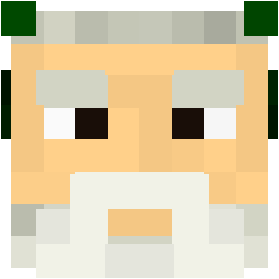
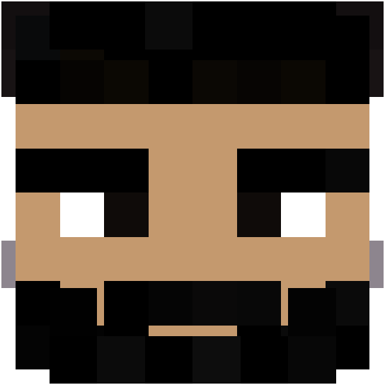

<div align="center">

# Cubatar


[Live Demo](http://87.251.76.217:8080/v1/avatar/Phemida?size=500)
</div>

---

Cubatar turns Minecraft usernames, UUIDs, or raw skin URLs into beautiful, layered 3D avatars. Built with Java 21 to be fast, stable, and easy to integrate.

## Why Cubatar?

- **Perfect Renders:** Full support for the second skin layer (hats, glasses, jackets).
- **Smart Inputs:** Just throw a Nickname, UUID, or Base64 at the API — it'll figure it out.
- **Blazing Fast:** Built-in Caffeine caching means zero Mojang rate-limits and instant responses.

## Gallery

<div align="center">
  
  
  
  
  
  
</div>

## Quick Start

### API Usage

Just make a `GET` request:
```bash
# size is optional (defaults to 64px)
curl "http://localhost:8080/v1/avatar/Notch?size=128"

# Using a direct URL (or base64 encoded URL)
curl "http://localhost:8080/v1/avatar/https%3A%2F%2Fexample.com%2Fskin.png"
```

### Run Locally

```bash
docker build -t cubatar .
docker run -p 8080:8080 cubatar

```
