<div align="center">

# Cubatar


</div>

---

Cubatar turns Minecraft usernames, UUIDs, or raw skin URLs into beautiful renders: flat icons, true-3D isometric heads and bodies, posed full-body "cards", and an embeddable interactive 3D viewer. Built with Java 21 to be fast, stable, and easy to integrate.

> **New:** a real voxel render engine — `/v1/iso/{head|body|full}` draws the player as actual 3D boxes under any camera angle, with in-game-accurate second-layer inflation, walking pose, and slim/classic model detection straight from the Mojang profile. Plus `/view/{input}`: a WebGL viewer page you can drop into an `<iframe>`.

## Why Cubatar?

- **True 3D, not sprite tricks:** the iso engine rotates real boxes (head, torso, limbs) and renders every visible face — second layers are inflated exactly like in-game (hat +0.5px, layers +0.25px per side), including the visible inner side of far faces.
- **Correct arm width:** slim/classic is read from the Mojang profile metadata (not guessed from pixels), with a transparency heuristic as fallback for direct URLs and an explicit `model=` override.
- **Smart inputs:** throw a nickname, UUID, or base64-encoded skin URL at any endpoint — it figures it out.
- **Fast & embed-friendly:** Caffeine caching against Mojang rate limits, `Cache-Control` on every PNG, and permissive CORS (`Access-Control-Allow-Origin: *`) so images work in canvas/WebGL on any site.
- **Legacy-proof:** old 64x32 skins render like in-game — mirrored left limbs, no overlay layers.

## Gallery

<div align="center">
  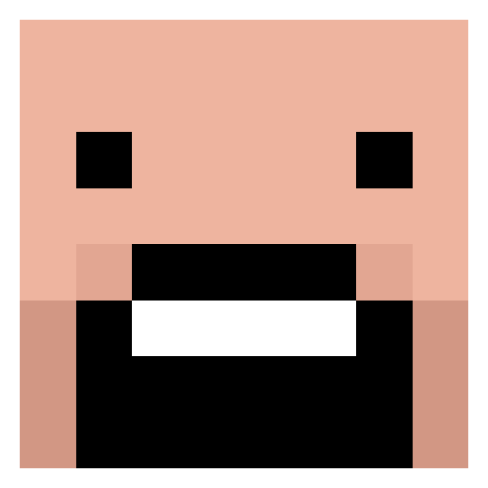
  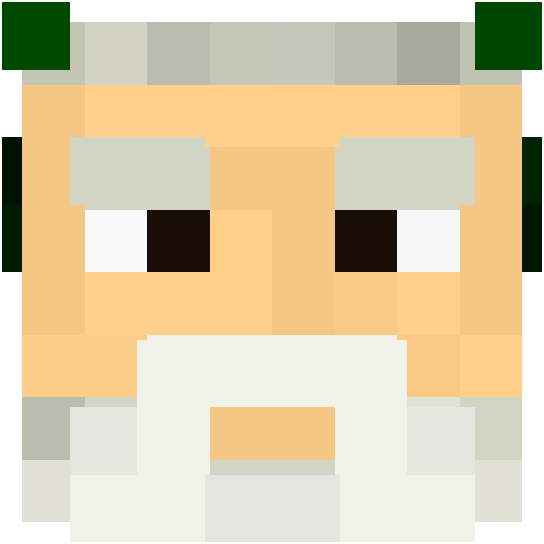
  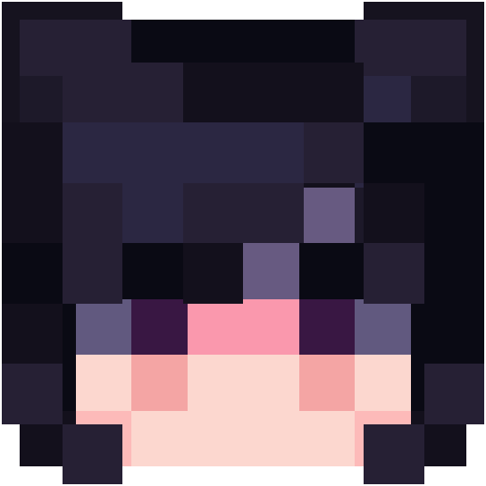
  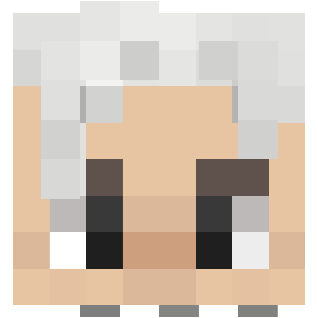
  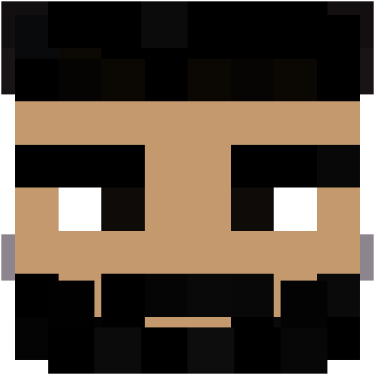
  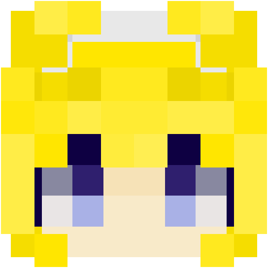
</div>

### 3D renders (iso engine)

<div align="center">
  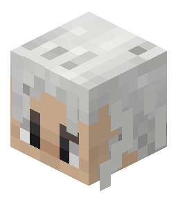
  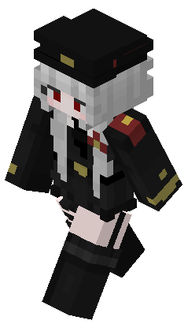
  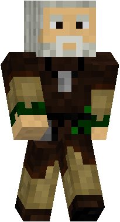
  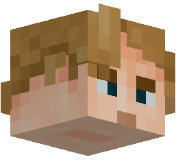
  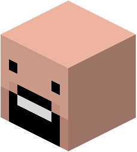
</div>

*Left to right: `/v1/iso/head`, `/v1/iso/full?pose=walk`, `/v1/iso/full?yaw=20&pitch=0&pose=walk` (the launcher-style "card" look), `/v1/iso/head?yaw=45&pitch=-15`, and a legacy 64x32 skin.*

### Launcher-style cards — `/v1/iso/full?yaw=20&pitch=0&pose=walk`

<div align="center">
  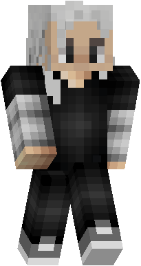
  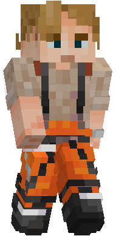
  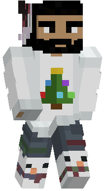
  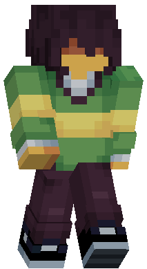
  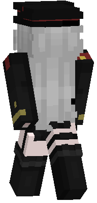
</div>

*The last one is the same request with `yaw=200` — any angle works, including from behind.*

### Full body, flat (front & back)

<div align="center">
  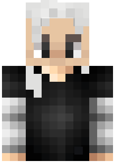
  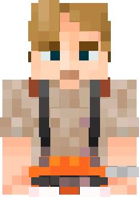
  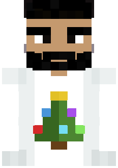
  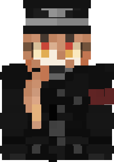
  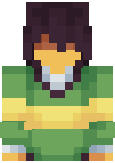
  <br/>
  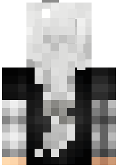
  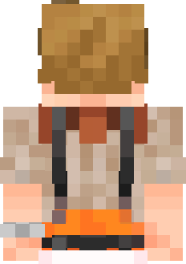
  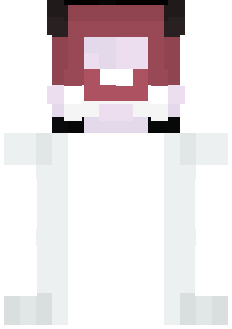
  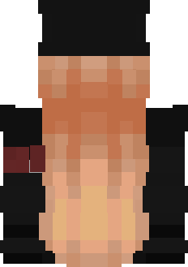
  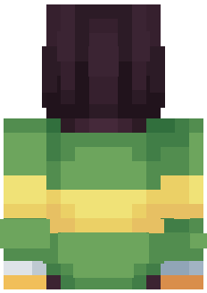
</div>

## API

`{input}` is a nickname, UUID, or base64url-encoded skin URL, everywhere.

### Flat renders

| Endpoint | What you get | Parameters (defaults) |
|---|---|---|
| `/v1/avatar/{input}` | Head icon with hat layer | `size=64` |
| `/v1/body/{input}` | Waist-up, front or back | `size=128`, `back=false`, `model=auto` |
| `/v1/skin/{input}` | Raw resolved skin texture | — |

### 3D renders (iso engine)

| Endpoint | What you get | Parameters (defaults) |
|---|---|---|
| `/v1/iso/head/{input}` | Head cube at any angle | `size=128`, `yaw=-45`, `pitch=30` |
| `/v1/iso/body/{input}` | Waist-up at any angle | + `pose=stand`, `model=auto` |
| `/v1/iso/full/{input}` | Full body at any angle | + `pose=stand`, `model=auto` |
| `/v2/avatar/{input}` | Head, front-facing by default | `size=64`, `yaw=0`, `pitch=0` |
| `/v2/body/{input}` | Waist-up, front/back by flag | `size=128`, `back=false`, `model=auto` |

`/v1/iso/{input}` without a sub-path stays as an alias of `/v1/iso/head/{input}`.

- `size` — head edge in pixels; every other part scales from it.
- `yaw` / `pitch` — camera angles in degrees.
- `pose=walk` — walking pose (right arm & left leg forward, like in-game).
- `model=slim|classic` — force arm width; `auto` uses Mojang profile metadata, falling back to a texture heuristic for direct URLs.

```bash
# Classic isometric head
curl "http://localhost:8080/v1/iso/head/Notch?size=256"

# Launcher-style full-body card for a profile page
curl "http://localhost:8080/v1/iso/full/Notch?yaw=20&pitch=0&pose=walk"

# Same skin, forced slim arms
curl "http://localhost:8080/v1/iso/full/Notch?model=slim"
```

### Interactive 3D viewer

`/view/{input}` serves a self-contained WebGL page (powered by [skinview3d](https://github.com/bs-community/skinview3d)) — drop it into an iframe and you get a rotatable, animated player model with zero backend rendering cost:

```html
<iframe src="https://your.host/view/Notch?headbob=false" width="300" height="400" frameborder="0"></iframe>
```

Parameters: `walk=true` (walking animation), `headbob=true` (head movement during walk), `rotate=true` (auto-rotate), `wheelzoom=false` (mouse-wheel zoom — off so the iframe doesn't steal scrolling), `zoom=0.9`, `fov=40`, `bg=` (hex color, transparent by default), `model=auto`.

## Quick Start

```bash
docker build -t cubatar .
docker run -p 8080:8080 cubatar
```

Legacy 64x32 skins (pre-1.8, no second layer / no slim arms) are detected automatically and rendered without the jacket/sleeves overlay, same as in-game.

## License

[AGPL-3.0](LICENSE). In short: use the public API freely; self-host freely — but if you host a modified Cubatar (including as a service), you must publish your changes under the same license and keep the attribution. Not affiliated with Mojang or Microsoft.
