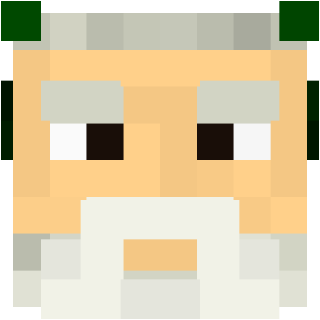
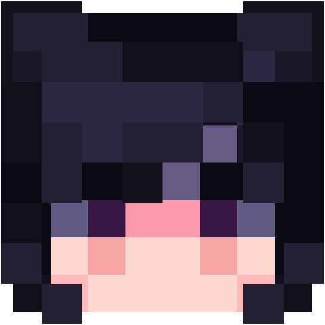
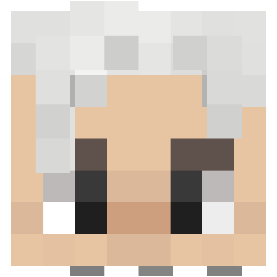
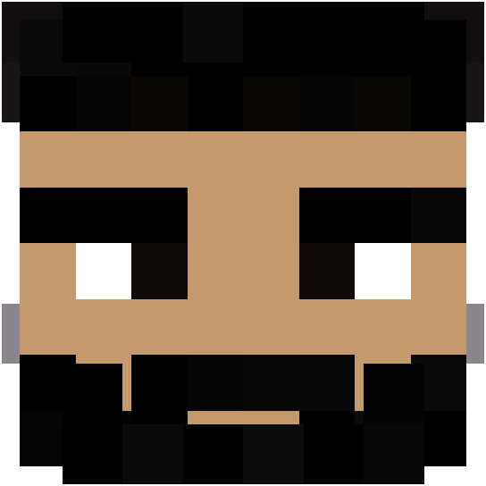
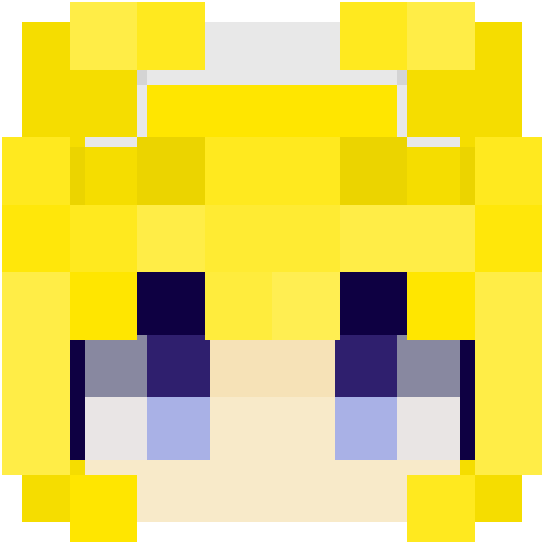

<div align="center">

# Cubatar


**Мощный и быстрый сервис генерации аватаров Minecraft.**

[Live Demo](http://87.251.76.217:8080/v1/avatar/Phemida?size=500) | [Документация](#документация-api) | [English](README.md)
</div>

---

Cubatar предоставляет простой, но мощный API для получения и рендеринга слоистых 3D-аватаров игроков Minecraft. Сервис обрабатывает различные варианты ввода, включая никнеймы, UUID и URL-адреса скинов в Base64, обеспечивая высококачественный рендеринг с поддержкой внешних слоев (шапки и т.д.).

## 🌟 Возможности

- **Послойный рендеринг**: Генерирует высококачественные аватары с корректным отображением второго слоя (шапки, аксессуары и т.д.) для полноценного внешнего вида.
- **Гибкий ввод**: Поддерживает:
    - Никнеймы Minecraft
    - UUID (автоматическое определение)
    - URL скина в Base64
- **Интеграция с Mojang**: Напрямую загружает скины через API сессий Mojang при необходимости.
- **Высокая производительность**:
    - **Умное кэширование**: Использует Caffeine для минимизации запросов к внешним API и снижения задержек.
    - **Асинхронная обработка**: Оптимизировано для высокой нагрузки.
- **Современный стек**: Построен на Java 21 и экосистеме Spring Boot.

## 🎨 Галерея

Примеры аватаров, сгенерированных Cubatar:

<div align="center">
  
  
  
  
  
  
</div>

## 🚀 Документация API

### Получить аватар игрока

`GET /v1/avatar/{input}`

Возвращает аватар для указанного игрока.

**Параметры:**

- `input` (путь): Никнейм Minecraft, UUID или URL скина в Base64.
- `size` (параметр запроса, необязательно): Ширина/высота изображения в пикселях. По умолчанию `64`.

**Пример:**

```bash
curl "http://localhost:8080/v1/avatar/Notch?size=128"
```

## 🛠 Технический стек

- **Язык**: Java 21
- **Фреймворк**: Spring Boot
- **Сборка**: Gradle
- **Кэширование**: Caffeine


## 📦 Начало работы

### Требования

- JDK 21 или выше.
- Docker (опционально).

### Локальный запуск

1. **Клонируйте репозиторий:**
   ```bash
   git clone https://github.com/Tok1shu/Cubatar.git
   cd Cubatar
   ```

2. **Сборка и запуск:**
   ```bash
   ./gradlew bootRun
   ```

### Запуск через Docker

1. **Сборка образа:**
   ```bash
   docker build -t cubatar .
   ```

2. **Запуск контейнера:**
   ```bash
   docker run -p 8080:8080 cubatar
   ```

Приложение запустится на порту `8080`.
